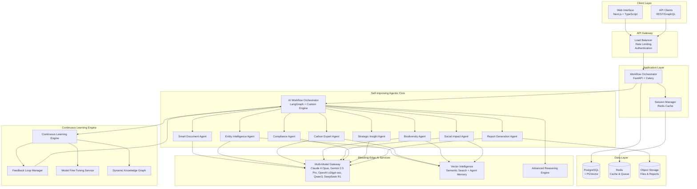

# Nexus: Self-Improving Agentic AI Architecture

## Architecture Philosophy

### **Self-Improving Agentic Core**
- **Autonomous Agent Networks**: A dynamic network of specialized AI agents, powered by a diverse portfolio of models including **Claude 4 Opus, Gemini 2.5 Pro, and OpenAI's o3 and gpt-oss series**, that collaborate to solve complex problems.
- **Emergent Intelligence**: System capabilities exceed the sum of individual agent capabilities through sophisticated, real-time interaction.
- **Self-Organizing Workflows**: Agents dynamically adapt their collaboration patterns based on the unique context of each problem, leveraging the **LangGraph** framework.
- **Continuous Learning Engine**: Every interaction, every piece of data, and every user feedback loop is captured and used to continuously improve the system's intelligence and capabilities. This is the heart of Nexus.

### **Human-AI Amplification Model**
- **AI-Augmented Expertise**: We elevate human consultants to a state of superhuman analytical capability.
- **Intelligent Delegation**: The AI handles the vast majority of routine analysis, allowing humans to focus on high-value strategic insights and client relationships.
- **Contextual Escalation**: A sophisticated handoff mechanism ensures that human expertise is engaged at the most critical moments.
- **Transparent Reasoning**: We provide full visibility into the multi-agent decision-making process, building trust and enabling collaboration.

## High-Level Architecture



## Component Design

### **Continuous Learning Engine**
**Role**: The core of Nexus's intelligence. This engine captures, processes, and integrates feedback from every part of the system to drive continuous improvement.

**Advanced Capabilities**:
- **Automated Feedback Capture**: Automatically logs user interactions, agent outputs, and system performance data.
- **Knowledge Graph Synthesis**: Continuously updates the central knowledge graph with new information and relationships.
- **Model Fine-Tuning**: Identifies opportunities for fine-tuning our models on specific tasks and datasets.
- **Performance Analytics**: Monitors and analyzes agent performance, identifying areas for improvement.

**Technology**: A custom-built engine leveraging technologies like Kafka for event streaming, Spark for data processing, and a graph database (like Neo4j) for the knowledge graph.

### **AI Workflow Orchestrator** 
**Role**: An autonomous AI system that intelligently coordinates multi-agent collaboration and feeds the Continuous Learning Engine.

**Advanced Capabilities**:
- **Dynamic Agent Selection**: The AI determines the optimal combination of agents for each unique task.
- **Intelligent Task Decomposition**: It breaks down complex problems into agent-specific subtasks.
- **Real-Time Adaptation**: It adjusts the workflow based on intermediate results and agent feedback.
- **Conflict Resolution & Synthesis**: It mediates between agents when their analyses diverge and synthesizes their outputs into a coherent whole.
- **Learning Signal Generation**: It identifies and flags high-value interactions for the Continuous Learning Engine.

**Technology**: A custom reasoning engine built on the **LangGraph** framework, incorporating best practices from **Google's ADK** and **Microsoft's AutoGen**, and powered by our multi-model gateway.

### **Advanced Document Intelligence Agent**
**Role**: A multi-modal AI specialist for complex document understanding.

**Cutting-Edge Capabilities**:
- **Multi-Modal Processing**: Seamlessly processes text, images, charts, tables, and even handwritten notes across any document format.
- **Contextual Understanding**: The AI comprehends the document's intent and its place within the broader organizational context.
- **Semantic Schema Mapping**: Advanced NLP automatically maps document columns to the relevant sustainability frameworks.
- **Intelligent Data Validation**: The AI detects inconsistencies, flags potential errors, and suggests corrections.
- **Adaptive Format Learning**: The system learns from new document formats, continuously improving its parsing capabilities.

**Technology**: A powerful combination of **Claude 4 Opus, Gemini 2.5 Pro, and OpenAI's o3 Vision models**, along with custom computer vision and advanced OCR models.

### **Entity Intelligence Agent**
**Role**: An advanced AI specialist for reasoning about organizational structures.

**Advanced AI Capabilities**:
- **Deep Entity Understanding**: The AI comprehends complex, nested, and non-obvious organizational relationships.
- **Contextual Relationship Mapping**: It understands implicit relationships and ownership networks.
- **Regulatory Intelligence**: It applies jurisdiction-specific entity classification rules.
- **Predictive Entity Analysis**: It identifies likely missing entities or relationships based on its understanding of similar organizations.
- **Cross-Reference Validation**: It verifies entity data against multiple internal and external sources in real time.

**Technology**: **Claude 4 Opus, Gemini 2.5 Pro**, custom fine-tuned open-source models (**gpt-oss, Qwen3**), advanced Graph Neural Networks, and real-time data APIs.

### **Domain Intelligence Agents**
(Carbon, Nature, Social, etc.)

These agents are specialized AI experts in their respective domains. They are powered by our multi-model gateway and have access to the central knowledge graph, allowing them to provide deep, context-aware insights.

### **Report Generation Agent**
**Role**: Transforms complex analysis into professional, actionable, and beautiful deliverables.

**Core Capabilities**:
- **Dynamic Template Engine**: Customizable report templates for different audiences and use cases.
- **Intelligent Data Visualization**: Automated generation of insightful and aesthetically pleasing charts and graphs.
- **AI-Generated Executive Summaries**: The agent generates high-level insights and strategic recommendations.
- **Multi-format Export**: PDF, Word, PowerPoint, and interactive web formats.
- **Brand Customization**: Client-specific styling and branding.

## Data Architecture

### **Primary Data Store (PostgreSQL + PGVector)**
**Purpose**: Persistent storage for core business data and vector embeddings.

**Schema Design**:
```sql
-- Core entities table
CREATE TABLE organization_entities (...);

-- Vector embeddings for semantic search
CREATE TABLE entity_embeddings (...);

-- Table for storing feedback for the learning engine
CREATE TABLE learning_feedback (
    id UUID PRIMARY KEY,
    session_id UUID REFERENCES processing_sessions(id),
    user_id UUID,
    agent_name VARCHAR(255),
    feedback_type VARCHAR(50), -- e.g., 'user_correction', 'model_confidence'
    content JSONB,
    created_at TIMESTAMP DEFAULT NOW()
);
```

### **Session Cache (Redis)**
**Purpose**: Temporary data storage and task queue management.

### **Object Storage (S3-Compatible)**
**Purpose**: Scalable storage for files, reports, and other large objects.

## Agent Communication Architecture

### **Event-Driven Communication**
**Pattern**: Agents communicate through a central message bus (e.g., Redis Pub/Sub or Kafka) using a structured, event-driven approach.

**Message Schema**:
```python
@dataclass  
class AgentMessage:
    message_id: str
    from_agent: str
    to_agent: str
    message_type: MessageType # e.g., TASK_REQUEST, TASK_COMPLETE, LEARNING_EVENT
    payload: Dict[str, Any]
    timestamp: datetime
    correlation_id: str
```

## Deployment Architecture

### **Development Environment**
**Technology**: Docker Compose with hot reloading for a seamless developer experience.

### **Production Environment**
**Technology**: Kubernetes with Helm charts for scalable, resilient, and automated deployments.

## Security Architecture

### **Authentication & Authorization**
- **User Authentication**: OAuth 2.0 with JWT tokens.
- **Service Authentication**: mTLS for secure inter-service communication.

### **Data Protection**
- **Encryption**: End-to-end encryption for data at rest and in transit.
- **PII Detection**: Automated identification and masking of sensitive data.

This architecture is designed to be a living system—one that learns, adapts, and grows more intelligent with every interaction. It is the foundation for a new generation of AI-powered sustainability intelligence.
