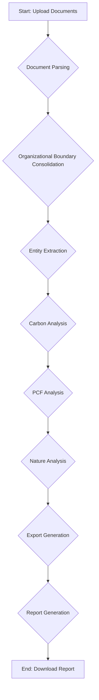

# Agent Orchestration

The Nexus platform uses a sophisticated multi-agent system to automate sustainability reporting. The `AgentOrchestrator` is the heart of this system, managing the workflow and coordinating the activities of specialized agents.

## The Workflow

The orchestration process follows a series of steps, each performed by a dedicated agent. This modular approach allows for flexibility and scalability.

Here is a high-level overview of the workflow:

## The Agents

Each step in the workflow is handled by a specialized agent:

- **`SmartDocumentAgent`**: Parses uploaded documents (e.g., CSV, XLSX) and extracts the raw data.
- **`OrgBoundaryAgent`**: Analyzes the data to determine the organizational boundary for reporting.
- **`EntityIntelligenceAgent`**: Identifies and extracts key entities (e.g., facilities, vehicles) from the data.
- **`CarbonExpertAgent`**: Performs carbon emissions calculations based on the extracted data.
- **`PCFExpertAgent`**: Conducts Product Carbon Footprint (PCF) analysis.
- **`NatureExpertAgent`**: Assesses nature-related impacts (e.g., TNFD, BNG).
- **`ReportGeneratorAgent`**: Synthesizes the results from all agents into a comprehensive report.

## What's Working vs. Not

### Working:

- **Document Parsing:** The system can successfully parse well-structured CSV and XLSX files.
- **Organizational Boundary:** The `OrgBoundaryAgent` can consolidate entities from multiple files.
- **Entity Extraction:** Basic entity extraction is functional.
- **Carbon Analysis:** The `CarbonExpertAgent` can perform initial carbon assessments.

### Needs Improvement:

- **Error Handling:** The system needs more robust error handling for malformed or unexpected data.
- **Complex Scenarios:** The agents currently struggle with complex organizational structures (e.g., joint ventures, partial ownership).
- **PCF and Nature Analysis:** The `PCFExpertAgent` and `NatureExpertAgent` are still in the early stages of development.
- **Report Generation:** The `ReportGeneratorAgent` produces a basic report, but it needs to be more customizable and visually appealing.

## What's Next

The immediate priorities for the development team are:

- **Improve data validation and error handling:** To make the system more resilient.
- **Enhance the `OrgBoundaryAgent`:** To handle more complex organizational structures.
- **Develop the `PCFExpertAgent` and `NatureExpertAgent`:** To provide more comprehensive sustainability analysis.
- **Improve the `ReportGeneratorAgent`:** To create more professional and customizable reports.
